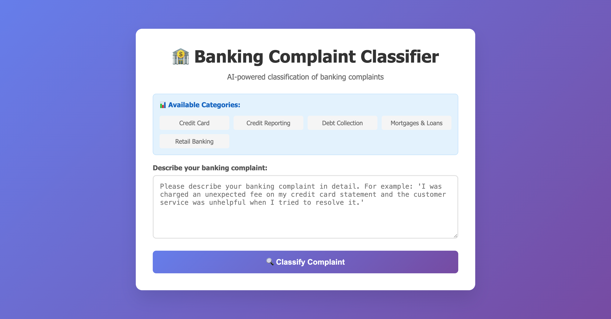

# Banking Complaint Classifier Web Application

**Note**: The README.md and index.html files were created with AI assistance.

A Flask-based web application that classifies banking complaints using machine learning models trained on consumer complaint data.

## Explanation

This project implements a machine learning system to automatically classify banking complaints into categories such as Credit Card, Credit Reporting, Debt Collection, Mortgages & Loans, and Retail Banking. The system uses natural language processing techniques to analyze complaint narratives and predict the appropriate category with high accuracy.

The application includes:
- A web interface for users to submit complaints
- A RESTful API for programmatic access
- Multiple machine learning models with performance comparison
- Comprehensive text preprocessing pipeline
- Real-time classification with confidence scores

## What I've Done

### Core Implementation
- **Data Processing**: Implemented comprehensive text preprocessing including lowercase conversion, punctuation removal, digit removal, and stopword elimination
- **Feature Engineering**: Used TF-IDF vectorization with n-grams (1,2) for text feature extraction
- **Model Training**: Trained and compared multiple machine learning models:
  - Logistic Regression
  - SGD Classifier
  - Multinomial Naive Bayes
- **Model Evaluation**: Implemented stratified K-Fold cross-validation (5 folds) for robust performance assessment
- **Web Application**: Created a Flask-based web interface with responsive design
- **API Development**: Built RESTful API endpoint for programmatic access

### Technical Achievements
- Achieved 87% overall accuracy with the best performing model
- Implemented comprehensive error handling and validation
- Created modular code structure for maintainability
- Added detailed documentation and troubleshooting guide
- Implemented proper model serialization and loading

## Features

- **Web Interface**: User-friendly form for entering complaint descriptions
- **Real-time Classification**: Instant prediction using the best performing model (SGD Classifier with TF-IDF)
- **API Endpoint**: RESTful API for programmatic access
- **Confidence Scores**: Shows prediction confidence when available
- **Responsive Design**: Works on desktop and mobile devices

## Interface

The web application provides a clean and intuitive interface for submitting banking complaints:



## Model Performance

The application uses the SGD Classifier model with TF-IDF vectorization, which achieved:
- **Overall Accuracy**: 87%
- **Categories**: Credit Card, Credit Reporting, Debt Collection, Mortgages & Loans, Retail Banking

## Installation

1. Install required dependencies:
```bash
pip install -r requirements.txt
```

2. Download the dataset from Kaggle: [Consumer Complaints Dataset for NLP](https://www.kaggle.com/datasets/shashwatwork/consume-complaints-dataset-fo-nlp)

3. Ensure the following files exist:
- `data/complaints.csv` (training data)
- Models will be created during training process

## Training the Model

To train the machine learning models from scratch:

1. **Prepare the training data:**
   - Ensure `data/complaints.csv` contains the complaint data with 'product' and 'narrative' columns
   - The script will automatically clean the text data

2. **Run the training script:**
```bash
python train.py
```

3. **Training process includes:**
   - Text preprocessing (lowercase, remove punctuation, digits, stopwords)
   - Stratified K-Fold cross-validation (5 folds) for model evaluation
   - Comparison of multiple models:
     - Logistic Regression
     - SGD Classifier
     - Multinomial Naive Bayes
   - Training the best performing model (SGD Classifier)
   - Saving the trained model and TF-IDF vectorizer

4. **Output files created:**
   - `models/vectorizer/tfidf_vectorizer.pkl` - TF-IDF vectorizer
   - `models/best_model.pkl` - Trained SGD model
   - `analysis/stratified_k_fold_for_analysis.csv` - Cross-validation results

## Usage

### Web Interface

1. Start the web server:
```bash
python web.py
```

2. Open your browser and go to: `http://localhost:5000`

3. Enter your banking complaint description in the text area

4. Click "Classify Complaint" to see the prediction

### API Usage

Send POST requests to `/api/predict` with JSON payload:

```bash
curl -X POST http://localhost:5000/api/predict \
  -H "Content-Type: application/json" \
  -d '{"complaint_text": "I was charged an unexpected fee on my credit card"}'
```

Response format:
```json
{
  "prediction": "credit_card",
  "confidence": 0.85,
  "original_text": "I was charged an unexpected fee on my credit card"
}
```

# Future Work and Improvements

This document outlines potential enhancements and next steps for the Banking Complaint Classifier project.

### Model Improvements

#### Advanced Machine Learning Models
- **Deep Learning Models**: Implement LSTM, GRU, or Transformer-based models (BERT, RoBERTa) for better text understanding
- **Ensemble Methods**: Combine multiple models using voting or stacking to improve accuracy
- **Hyperparameter Optimization**: Use GridSearchCV or Bayesian optimization for better model tuning
- **Word Embeddings**: Experiment with pre-trained embeddings like GloVe, fastText, or domain-specific embeddings

#### Feature Engineering
- **Sentiment Analysis**: Add sentiment scores as additional features
- **Named Entity Recognition**: Extract and use entities (banks, amounts, dates) as features
- **Text Length and Complexity**: Include metadata features like text length, readability scores
- **Temporal Features**: Add time-based features if timestamp data is available

### Data Enhancements

#### Dataset Expansion
- **Data Augmentation**: Use techniques like back-translation, synonym replacement to increase training data
- **External Data Sources**: Incorporate additional consumer complaint datasets from regulatory bodies
- **Multi-language Support**: Extend to handle complaints in other languages
- **Imbalanced Data Handling**: Implement SMOTE or other techniques for class imbalance

#### Data Quality
- **Advanced Cleaning**: Implement more sophisticated text preprocessing (lemmatization, spell correction)
- **Data Validation**: Add automated data quality checks and validation pipelines
- **Annotation Guidelines**: Create clear guidelines for human annotation if expanding dataset

### Application Features

#### User Interface Improvements
- **Real-time Suggestions**: Provide auto-complete or suggestions as users type
- **Batch Processing**: Allow classification of multiple complaints at once
- **Export Functionality**: Enable results export to CSV, PDF, or other formats
- **User Dashboard**: Create analytics dashboard for complaint trends and statistics

#### API Enhancements
- **Authentication**: Add API key authentication for production use
- **Rate Limiting**: Implement rate limiting to prevent abuse
- **Batch API Endpoint**: Create endpoint for bulk classification
- **Webhook Support**: Add webhook notifications for async processing

#### Advanced Features
- **Explainable AI**: Implement SHAP or LIME for model interpretability
- **Confidence Thresholds**: Allow users to set confidence thresholds for predictions
- **Human-in-the-Loop**: Add functionality for human review of low-confidence predictions
- **Multi-label Classification**: Support complaints that belong to multiple categories

### Technical Improvements

#### Performance Optimization
- **Model Optimization**: Use model quantization or pruning for faster inference
- **Caching**: Implement Redis caching for frequent predictions
- **Load Balancing**: Set up load balancing for high-traffic scenarios
- **Async Processing**: Use background workers for heavy processing tasks

#### Infrastructure and DevOps
- **Containerization**: Dockerize the application for easy deployment
- **CI/CD Pipeline**: Set up automated testing and deployment
- **Monitoring**: Add application monitoring and logging (Prometheus, Grafana)
- **Scalability**: Design for horizontal scaling with microservices architecture

#### Security
- **Input Validation**: Add comprehensive input sanitization
- **SQL Injection Protection**: Ensure database queries are parameterized
- **HTTPS**: Implement SSL/TLS for secure communication
- **Data Privacy**: Ensure compliance with data protection regulations (GDPR, CCPA)

### Research and Analysis

#### Model Analysis
- **Error Analysis**: Systematic analysis of misclassified examples
- **Feature Importance**: Analyze which features contribute most to predictions
- **Cross-validation Studies**: More extensive cross-validation with different strategies
- **A/B Testing**: Implement A/B testing for model comparison in production

#### Business Intelligence
- **Trend Analysis**: Track complaint trends over time
- **Geographic Analysis**: Analyze complaints by region if location data available
- **Root Cause Analysis**: Identify common patterns in complaint categories
- **Predictive Analytics**: Forecast complaint volumes and trends

### Documentation and Testing

#### Testing
- **Unit Tests**: Comprehensive unit test coverage for all components
- **Integration Tests**: Test end-to-end workflows
- **Performance Tests**: Load testing for API endpoints
- **Model Validation Tests**: Automated tests for model performance

#### Documentation
- **API Documentation**: Comprehensive API documentation with Swagger/OpenAPI
- **Developer Guide**: Detailed setup and contribution guidelines
- **User Manual**: End-user documentation with examples and tutorials
- **Technical Architecture**: Document system architecture and design decisions

### Deployment Options

#### Cloud Platforms
- **AWS**: Deploy using EC2, Lambda, or SageMaker
- **Google Cloud**: Use Cloud Run, AI Platform, or Kubernetes Engine
- **Azure**: Deploy on Azure App Service or Azure ML
- **Heroku**: Simple deployment option for smaller applications

#### Edge Deployment
- **Mobile App**: Create mobile application for on-device classification
- **Browser Extension**: Browser extension for real-time complaint classification
- **IoT Integration**: Integrate with customer service systems

### Compliance and Ethics

#### Regulatory Compliance
- **Financial Regulations**: Ensure compliance with banking and financial regulations
- **Data Protection**: Implement proper data anonymization and protection
- **Audit Trails**: Maintain comprehensive audit logs
- **Fairness**: Ensure model doesn't discriminate against protected groups

#### Ethical Considerations
- **Bias Detection**: Regular testing for model bias
- **Transparency**: Clear communication about model limitations
- **User Consent**: Proper consent mechanisms for data usage
- **Accountability**: Clear responsibility for model decisions

### Timeline and Priorities

#### Short Term (1-3 months)
- Implement comprehensive testing suite
- Add model performance monitoring
- Create batch processing API
- Improve data preprocessing pipeline

#### Medium Term (3-6 months)
- Experiment with advanced ML models
- Implement explainable AI features
- Add user dashboard and analytics
- Containerize and deploy to cloud

#### Long Term (6+ months)
- Multi-language support
- Advanced ensemble methods
- Full CI/CD pipeline
- Mobile application development

### Resources Needed

#### Technical Resources
- Additional compute resources for model training
- Storage for expanded datasets
- Cloud deployment credits
- Monitoring and logging infrastructure

#### Human Resources
- Data scientists for model improvement
- DevOps engineers for infrastructure
- UI/UX designers for interface improvements
- Domain experts for banking industry knowledge

#### Budget Considerations
- Cloud hosting costs
- Third-party API subscriptions
- Data acquisition costs
- Development tools and licenses

## Project Structure

```
BankingComplaint/
├── web.py                 # Flask web application
├── train.py              # Model training script
├── templates/
│   └── index.html        # HTML template
├── models/
│   ├── vectorizer/
│   │   └── tfidf_vectorizer.pkl  # TF-IDF vectorizer
│   └── best_model.pkl    # Trained SGD model
├── data/
│   └── complaints.csv    # Training data
├── analysis/
│   └── stratified_k_fold_for_analysis.csv  # Cross-validation results
├── main.ipynb           # Jupyter notebook with model training
└── requirements.txt     # Python dependencies
```

## License

---

### MIT License

Copyright (c) 2026 Banking Complaint Classifier

Permission is hereby granted, free of charge, to any person obtaining a copy
of this software and associated documentation files (the "Software"), to deal
in the Software without restriction, including without limitation the rights
to use, copy, modify, merge, publish, distribute, sublicense, and/or sell
copies of the Software, and to permit persons to whom the Software is
furnished to do so, subject to the following conditions:

The above copyright notice and this permission notice shall be included in all
copies or substantial portions of the Software.

THE SOFTWARE IS PROVIDED "AS IS", WITHOUT WARRANTY OF ANY KIND, EXPRESS OR
IMPLIED, INCLUDING BUT NOT LIMITED TO THE WARRANTIES OF MERCHANTABILITY,
FITNESS FOR A PARTICULAR PURPOSE AND NONINFRINGEMENT. IN NO EVENT SHALL THE
AUTHORS OR COPYRIGHT HOLDERS BE LIABLE FOR ANY CLAIM, DAMAGES OR OTHER
LIABILITY, WHETHER IN AN ACTION OF CONTRACT, TORT OR OTHERWISE, ARISING FROM,
OUT OF OR IN CONNECTION WITH THE SOFTWARE OR THE USE OR OTHER DEALINGS IN THE
SOFTWARE.

---

## Contact

**Email**: yosua.yerikho123@gmail.com  
**Country**: Indonesia

Feel free to contact me for any questions, suggestions, or collaboration opportunities regarding this project.

## Troubleshooting

- **Model Loading Errors**: Ensure `models/best_model.pkl` and `models/vectorizer/tfidf_vectorizer.pkl` exist and are accessible
- **Data Loading Errors**: Verify `data/complaints.csv` exists in the correct location with 'product' and 'narrative' columns
- **Import Errors**: Install all required packages using `pip install -r requirements.txt`
- **NLTK Download Issues**: The training script automatically downloads stopwords. If issues occur, manually run: `python -c "import nltk; nltk.download('stopwords')"`
- **Port Conflicts**: The application runs on port 5000 by default. Modify `web.py` to change the port if needed
- **Training Issues**: 
  - Ensure sufficient disk space for model files
  - Check that the CSV file is not corrupted
  - Verify Python version compatibility (3.7+ recommended)
- **Memory Issues**: For large datasets, consider reducing `max_features` in the TF-IDF vectorizer or using a smaller sample of the data